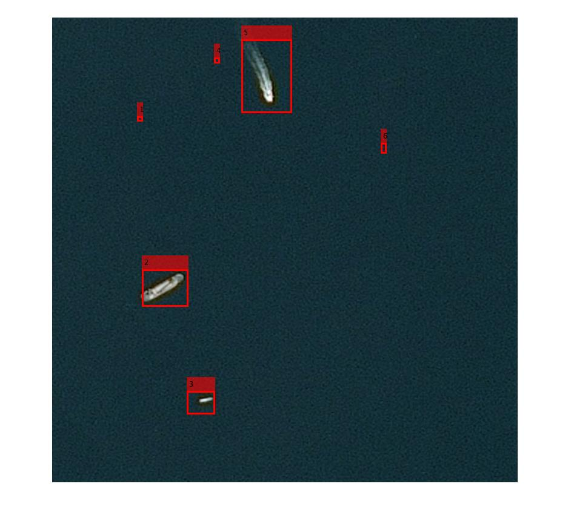

# Ship Detection
Final project for EECE 5644

## Authors
Henry Gridley,
Haley Weinstein,
Jon White

## Dataset
[Airbus Ship Detection Challenge](https://www.kaggle.com/c/airbus-ship-detection)

## Files
### Matlab Functions & Scripts
- `calculateError.m`: Runs model on test data in `test_detections.csv` and calculates error percentage
- `createDataMatrix.m`: Loads `train_detections.csv` and creates a feature matrix from the training data
- `drawLabeledBoxes.m`: Draws labeled boxes on an image using a heatmap to determine clusters
- `featureExtraction.m`: Extracts color, gradient, and spatial features from a data sample
- `featurePCA.m`: Performs PCA on a feature matrix
- `getBoundingBoxes.m`: Uses the dataset and provided CSV file to create `train_detections.csv` and `test_detections.csv`
- `makePredictions.m`: Scans a satellite image and attempts to find ships
- `ship_detection.m`: Ship detection pipeline. This is the main script
- `smoothImage.m`: Filters an image using a median filter
- `thresholdHeatmap.m`: Performs thresholding on a heatmap (output of `makePredictions()`)

### Other Files
- `train_detections.csv`: Pre-processed data for training
- `test_detections.csv`: Pre-processed data for testing
- `data.mat`: Training data loaded from `train_detections.csv`
- `ship_detection_model.mat`: Trained SVM classifier model
- `project_proposal.pdf`: EECE 5644 final project proposal

## Running Pipeline
1. Clone git repo to `Documents/MATLAB`
2. Download dataset and extract to `Documents/MATLAB/Ship-Detection`
3. Open `ship_detection.m` in Matlab and run

## Results
Classification of a single satellite image

